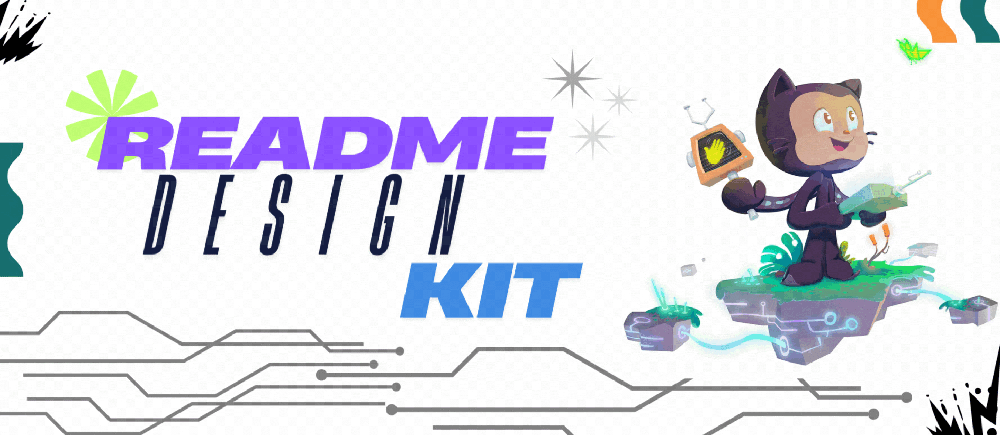

[](LICENSE)
[]()
[]()

Welcome to the **README Design Kit** — your one-stop starter pack for writing clean, organized, and beginner-friendly README files for your GitHub projects!

---

## 📚 Table of Contents

- [🚀 About the Project](#-about-the-project)
- [✨ Features](#-features)
- [� Documentation](#-documentation)
- [�🛠️ Getting Involved (SSoC S4)](#️-getting-involved-ssoc-s4)
- [📅 Participated In](#-participated-in)
- [📄 License](#-license)

---

<h2 style="font-family: Helvetica, sans-serif;">🚀 About the Project</h2>

`README_Design_Kit` is an open-source template project meant to help developers and contributors create high-quality, consistent, and appealing `README.md` files for any type of GitHub project — whether you're building a Python CLI tool, a web app, or participating in open-source programs like **SSoC**.

This project aims to:
- Provide clean templates for quick copy-paste use
- Encourage good documentation practices
- Help beginners make their projects more discoverable and understandable

---

## 🌟 Project Showcase Page  

The **Project Showcase Page** allows contributors to **explore high-quality README implementations** across various categories. It enables users to:
- **🔎 Search & Filter Projects** by title, description, and tags.
- **📂 Browse Categories** like Web Apps, Libraries, AI/ML, and Desktop.
- **📝 Submit Their Own README-Based Projects** through an integrated form.
- **🔗 Expand Cards** to preview README files, visit GitHub repos, and explore live demos.
- **🚀 Discover Well-Designed README Examples** to improve documentation practices.

---

<h2 style="font-family: Helvetica, sans-serif;">✨ Features</h2>

- ✅ Scrollable Table of Contents  
- ✅ Clean sectioned layout with emojis and headers  
- ✅ Easy-to-use Markdown examples  
- ✅ Styled project sections (e.g., Features, How to Contribute)  
- ✅ Ready-to-fork template for SSoC or hackathons  
- ✅ **Project Showcase Page** for exploring and submitting README examples  
- ✅ Advanced search & category-based organization  
- ✅ Expandable project cards with README previews and GitHub links  
- ✅ User submission form to showcase projects  

---

<h2 style="font-family: Helvetica, sans-serif;">� Documentation</h2>

Comprehensive documentation is available to help you understand and contribute to the project:

| 📖 **Guide** | 📝 **Description** |
|-------------|-------------------|
| [📚 Documentation Index](./docs/README.md) | Navigate all available documentation |
| [📘 Setup & Development Guide](./docs/setup.md) | Complete setup instructions and development guidelines |
| [🏗️ Project Architecture](./docs/architecture.md) | Technical structure and architecture overview |
| [📂 Files Documentation](./docs/files.md) | Detailed explanation of every file and directory |
| [🎨 README Elements Library](./READMEelements.md) | Complete collection of README components and examples |
| [🌟 Project Showcase](./docs/showcase.md) | Explore featured projects & submit your own |
| [🤝 Contributing Guidelines](./CONTRIBUTING.md) | How to contribute to the project |
| [📋 Code of Conduct](./CODE_OF_CONDUCT.md) | Community guidelines and standards |
| [🔒 Security Policy](./SECURITY.md) | Security vulnerability reporting |

**Quick Links for Contributors:**
- 🚀 [Quick Start Guide](./docs/setup.md#quick-start) - Get running in 5 minutes
- 🏗️ [Architecture Overview](./docs/architecture.md#overview) - Understand the tech stack
- 📂 [Project Structure](./docs/files.md#-architecture-overview) - Navigate the codebase
- 🎨 [Element Examples](./READMEelements.md) - Browse README components

---

<h2 style="font-family: Helvetica, sans-serif;">�🛠️ Getting Involved (SSoC S4)</h2>

Are you participating in **SSoC Season 4**? Here's how you can contribute:

### 📌 Steps to Get Started:
1. **Fork this repository**
    > 

2. **Clone the forked repository** to your local machine
    > 

    - OR You can copy the above and run it in your terminal like this:
    ```bash
    git clone the_link
   ```
3. **Move into the project directory**
   ```bash
    cd README_Design_Kit
   ```
3. **Create a new branch** for your changes
    ```bash
    git checkout -b your_branch_name
   ```
3. **Check the open issues** Visit the original repository and click on the issues tab, then choose the ones labeled `good first issue` or `ssoc` ot `beginner`
    > 

4. **Comment to get assigned** to a task
    > 

5. **Start editing, make your changes and commit them**
    ```bash
    git add .
   ```
6. **Push your changes** to your branch
    ```bash
    git commit -m "your commit message"
    git push origin your_branch_name
   ```
6. **Submit a pull request** with a clear description and always remeber to go through the contribution.md and the guidelines in the repository. Go to your forked repository and click on the pull request tab, then click on the "New pull request" button OR you can click on Compare and Pull Request.
    > 


### 💡 Suggestions for Contributions:
- Add new README templates (for different tech stacks)
- Improve the structure or visuals of existing templates
- Add README templates in other languages (Hindi, Spanish, etc.)

### 🙌 Community Guidelines
- Be respectful and inclusive
- Ask questions if you're unsure — here to help!
- Every contribution counts, no matter how small

---

<h2 style="font-family: Helvetica, sans-serif;">📅 Participated In</h2>

| Sr. No. | Program Name               | Timeline         |
|--------:|----------------------------|------------------|
| 1       | Social Summer of Code 2025 | June - August    |

> Add more entries here as you participate.

---

<h2 style="font-family: Helvetica, sans-serif;">📄 License</h2>

This project is licensed under the **MIT License**.  
You're free to use, modify, and distribute it with attribution.

**📌 Project Admin**: [Mayur Pagote](https://github.com/Mayur-Pagote)

---

> Made with ❤️ for open-source and SSoC contributors.
