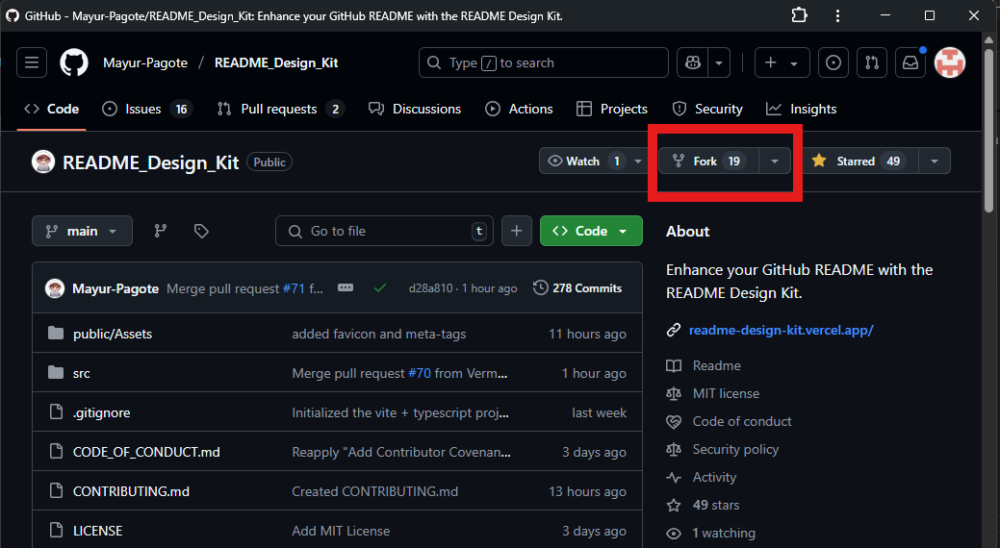
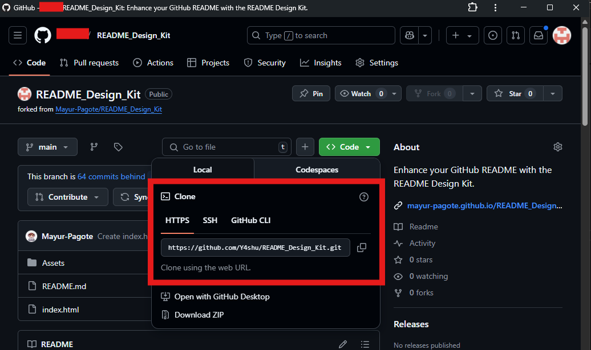
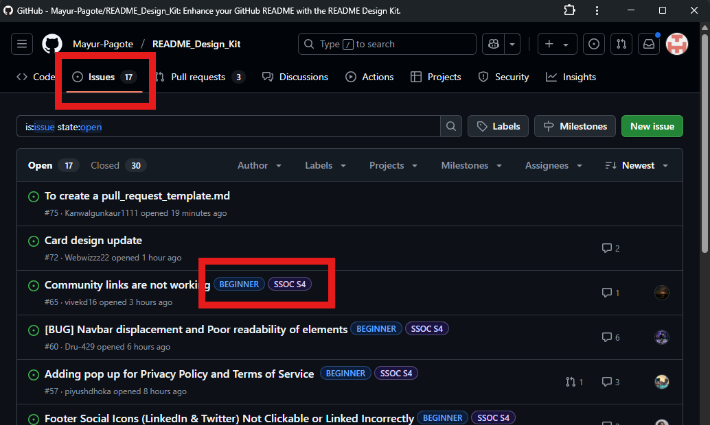
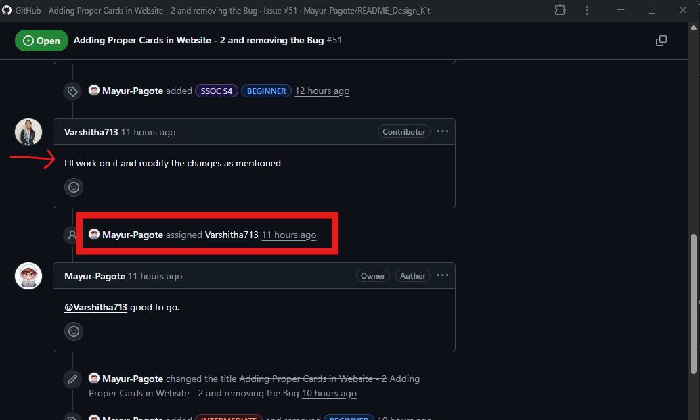
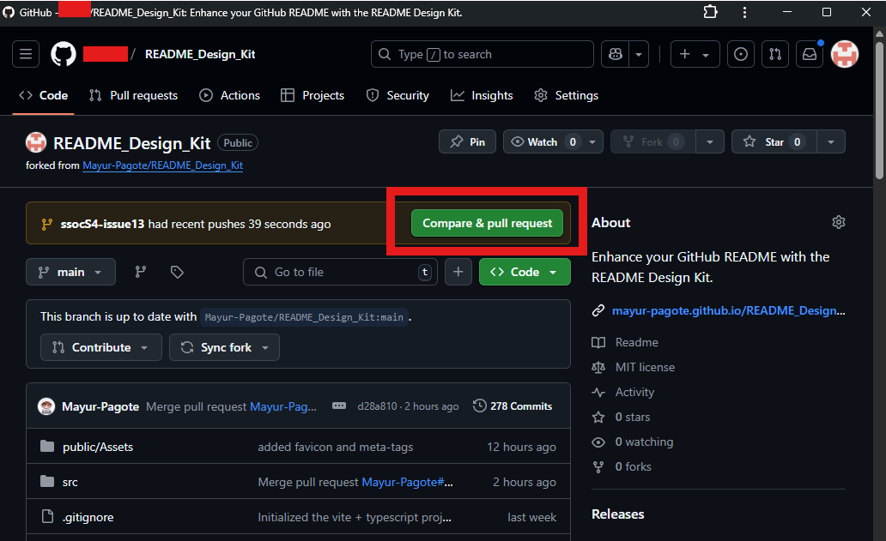

# 📘 README Design Kit

[](LICENSE)
[]()
[]()

Welcome to the **README Design Kit** — your one-stop starter pack for writing clean, organized, and beginner-friendly README files for your GitHub projects!

---

## 📚 Table of Contents

- [🚀 About the Project](#-about-the-project)
- [✨ Features](#-features)
- [📷 Screenshots](#-screenshots)
- [🛠️ Getting Involved (SSoC S4)](#️-getting-involved-ssoc-s4)
- [📅 Participated In](#-participated-in)
- [📄 License](#-license)

---

<h2 style="font-family: Helvetica, sans-serif;">🚀 About the Project</h2>

`README_Design_Kit` is an open-source template project meant to help developers and contributors create high-quality, consistent, and appealing `README.md` files for any type of GitHub project — whether you're building a Python CLI tool, a web app, or participating in open-source programs like **SSoC**.

This project aims to:
- Provide clean templates for quick copy-paste use
- Encourage good documentation practices
- Help beginners make their projects more discoverable and understandable

---

<h2 style="font-family: Helvetica, sans-serif;">✨ Features</h2>

- ✅ Scrollable Table of Contents  
- ✅ Clean sectioned layout with emojis and headers  
- ✅ Easy-to-use Markdown examples  
- ✅ Styled project sections (e.g., Features, How to Contribute)  
- ✅ Ready-to-fork template for SSoC or hackathons  

---

<h2 style="font-family: Helvetica, sans-serif;">🛠️ Getting Involved (SSoC S4)</h2>

Are you participating in **SSoC Season 4**? Here's how you can contribute:

### 📌 Steps to Get Started:
1. **Fork this repository**
    > 
2. **Clone the forked repository** to your local machine
    > 
    - OR You can copy the above and run it in your terminal like this:
    ```bash
    git clone the_link
   ```
3. **Move into the project directory**
   ```bash
    cd README_Design_Kit
   ```
3. **Create a new branch** for your changes
    ```bash
    git checkout -b your_branch_name
   ```
3. **Check the open issues** Visit the original repository and click on the issues tab, then choose the ones labeled `good first issue` or `ssoc` ot `beginner`
    > 
4. **Comment to get assigned** to a task
    > 
5. **Start editing, make your changes and commit them**
    ```bash
    git add .
   ```
6. **Push your changes** to your branch
    ```bash
    git commit -m "your commit message"
    git push origin your_branch_name
   ```
6. **Submit a pull request** with a clear description and always remeber to go through the contribution.md and the guidelines in the repository. Go to your forked repository and click on the pull request tab, then click on the "New pull request" button OR you can click on Compare and Pull Request.
    > 

### 💡 Suggestions for Contributions:
- Add new README templates (for different tech stacks)
- Improve the structure or visuals of existing templates
- Add README templates in other languages (Hindi, Spanish, etc.)

### 🙌 Community Guidelines
- Be respectful and inclusive
- Ask questions if you're unsure — here to help!
- Every contribution counts, no matter how small

---

<h2 style="font-family: Helvetica, sans-serif;">📅 Participated In</h2>

| Sr. No. | Program Name               | Timeline         |
|--------:|----------------------------|------------------|
| 1       | Social Summer of Code 2025 | June - August    |

> Add more entries here as you participate.

---

<h2 style="font-family: Helvetica, sans-serif;">📄 License</h2>

This project is licensed under the **MIT License**.  
You're free to use, modify, and distribute it with attribution.

**📌 Project Admin**: [Mayur Pagot]

---

> Made with ❤️ for open-source and SSoC contributors.